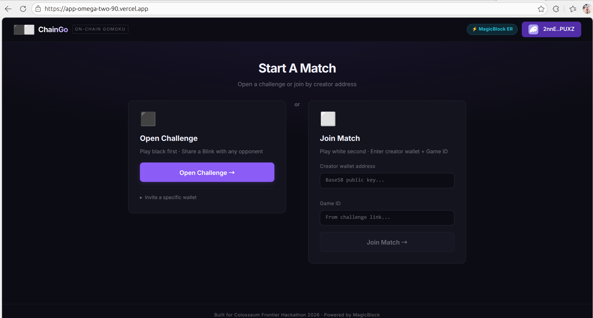
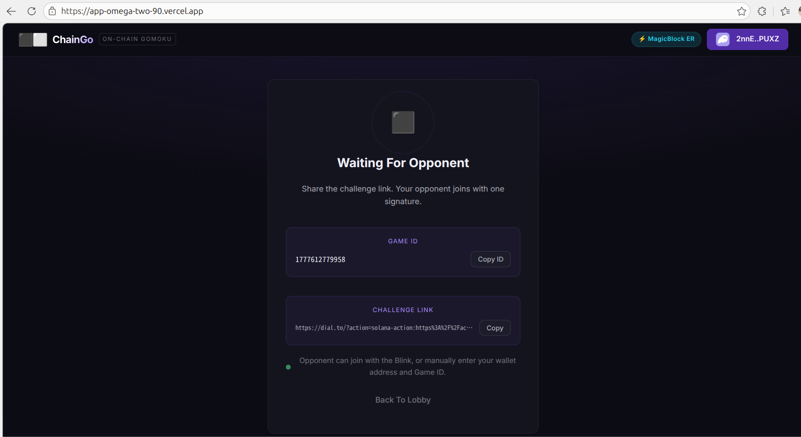
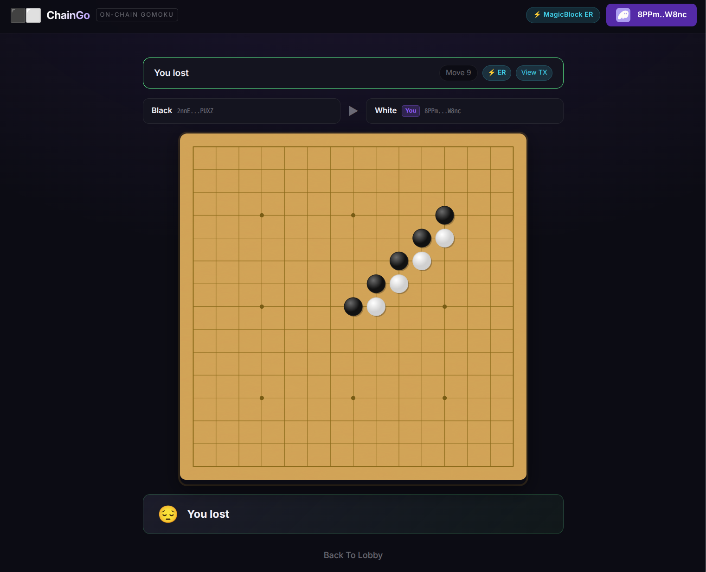
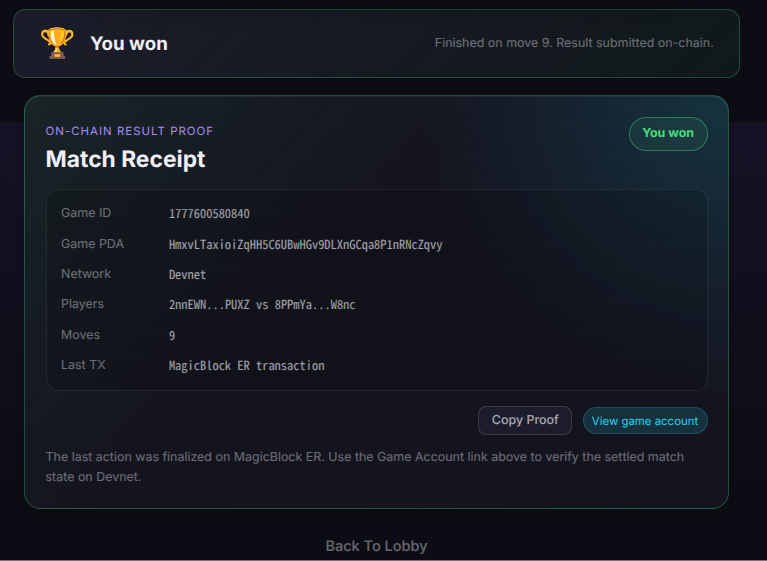

# ChainGo

> Fully on-chain Gomoku on Solana, accelerated by MagicBlock Ephemeral Rollups.  
> Built for [Colosseum Frontier Hackathon 2026](https://colosseum.org/frontier).

[](LICENSE)
[](https://solana.com)
[](https://magicblock.gg)

## Live Demo

ChainGo is currently deployed on Solana Devnet and MagicBlock Devnet ER.

| Entry        | URL                                            |
| :----------- | :--------------------------------------------- |
| Web App      | <https://app-omega-two-90.vercel.app>          |
| Telegram Bot | [@ChainGoBot](https://t.me/ChainGoBot)         |
| Actions API  | <https://actions-rho.vercel.app>               |
| Program ID   | `9eFVwR68X9oc3nLyUMgTQu1esXQpgawhGJk7dp1KkKMJ` |

Recommended demo setup:

- Use two different wallets on Solana Devnet.
- On desktop Chrome, Phantom is discovered through Wallet Standard when the extension is available.
- Inside Telegram, use Solflare directly or tap `Open in Phantom` to continue inside Phantom's mobile browser.
- Keep a little Devnet SOL in each wallet for create, join, delegate, session authorization, and settlement transactions.

## Overview

ChainGo is a trust-minimized Gomoku game where the game account lives on Solana and active gameplay runs on MagicBlock Ephemeral Rollups for low-latency moves.

- Player A creates an open challenge on Solana.
- Player B joins with a wallet signature from a shared challenge link or manual join form.
- The game account is delegated to MagicBlock ER after both players are present.
- Players authorize a Session Key once, then place stones on ER without repeated wallet popups.
- Win detection happens client-side, then the program verifies the submitted five-stone line on-chain.

Current demo status: the two-player create, join, delegate, play, and settle flow has been successfully tested locally on Devnet.

## User Experience

The game is designed around a minimal on-chain interaction flow:

1. Player A signs once to create an open challenge.
2. Player B signs once to join the challenge.
3. Player A signs once to delegate the game account to MagicBlock ER.
4. Each player authorizes one Session Key for fast in-game moves.
5. Normal moves are sent through the Session Key without repeated wallet popups.
6. Game settlement, such as `claim_win` and `undelegate_game`, remains verifiable on-chain.

Telegram-specific wallet handling:

- Telegram's in-app browser does not inject browser-extension wallets such as Phantom.
- ChainGo shows a wallet tip in Telegram/mobile WebView with an `Open in Phantom` deeplink.
- Solflare remains available through the wallet selector because it is explicitly included in the app's wallet adapter list.

## Demo









## Architecture

```text
┌─────────────────────────────────────────────────────────┐
│                  React TMA Frontend                     │
│  Vite · Wallet Adapter · Anchor client · Game UI        │
└───────────────────────────┬─────────────────────────────┘
                            │ challenge link / manual join
                            ▼
┌─────────────────────────────────────────────────────────┐
│              Solana Actions API                         │
│  Next.js · GET metadata · POST unsigned join_game tx     │
└───────────────────────────┬─────────────────────────────┘
                            │ join_game signed by Player B
                            ▼
┌─────────────────────────────────────────────────────────┐
│                 Solana Devnet Base Chain                │
│  create_open_game · join_game · delegate_game           │
└───────────────────────────┬─────────────────────────────┘
                            │ delegated account
                            ▼
┌─────────────────────────────────────────────────────────┐
│              MagicBlock Ephemeral Rollup                │
│  Session Keys · place_stone · claim_win · resign        │
└─────────────────────────────────────────────────────────┘
```

## Repository

```text
CardGame/
├── programs/chain_go/              # Anchor program
│   └── src/lib.rs
├── app/                            # Vite + React frontend
│   └── src/
│       ├── components/Game.tsx
│       ├── hooks/useGame.ts
│       └── utils/program.ts
├── actions/                        # Solana Actions API
│   └── app/api/actions/join/
├── doc/                            # Hackathon docs and demo images
├── deploy.sh                       # Devnet build/deploy helper
└── Anchor.toml
```

## Smart Contract

Current Devnet Program ID:

```text
9eFVwR68X9oc3nLyUMgTQu1esXQpgawhGJk7dp1KkKMJ
```

Core instructions:

| Instruction                     | Purpose                                                                                       |
| :------------------------------ | :-------------------------------------------------------------------------------------------- |
| `create_game(game_id, player2)` | Create a directed game for a specific opponent.                                               |
| `create_open_game(game_id)`     | Create an open challenge that any opponent can join.                                          |
| `join_game()`                   | Register Player B and start the game.                                                         |
| `delegate_game()`               | Delegate the game PDA to MagicBlock ER after Player B joins.                                  |
| `place_stone(position)`         | Place a stone at board position `0..224` on ER; supports wallet signer or Session Key signer. |
| `claim_win([u8; 5])`            | Verify a claimed five-stone line on-chain; supports Session Keys.                             |
| `resign()`                      | Resign from the current match; supports Session Keys.                                         |
| `undelegate_game()`             | Commit and return the game account to the base chain.                                         |

Each game PDA includes `game_id` in its seeds:

```text
["game", player1_pubkey, game_id_u64_le]
```

This lets the same wallet create multiple challenges without colliding with previously delegated game accounts.

## Local Setup

### Prerequisites

- Rust and Cargo
- Solana CLI / Agave CLI
- Anchor CLI `0.31.0`
- Node.js 20+
- Phantom or another Solana wallet configured for Devnet

If your Solana CLI is installed under the Agave release path, add it to `PATH`:

```bash
export PATH="$HOME/.avm/bin:$HOME/.cargo/bin:$HOME/.local/share/solana/install/active_release/bin:$PATH"
```

### Install Dependencies

```bash
cd ~/project/CardGame
npm install --prefix app
npm install --prefix actions
```

### Configure Environment

```bash
cp app/.env.example app/.env.local
cp actions/.env.example actions/.env.local
```

For the current Devnet deployment, set:

```bash
# app/.env.local
VITE_PROGRAM_ID=9eFVwR68X9oc3nLyUMgTQu1esXQpgawhGJk7dp1KkKMJ
VITE_BASE_RPC=https://api.devnet.solana.com
VITE_SOLANA_CLUSTER=devnet
VITE_ER_RPC=https://devnet-as.magicblock.app
VITE_DELEGATION_PROGRAM_ID=DELeGGvXpWV2fqJUhqcF5ZSYMS4JTLjteaAMARRSaeSh
VITE_MAGIC_CONTEXT=MagicContext1111111111111111111111111111111
VITE_MAGIC_PROGRAM=Magic11111111111111111111111111111111111111
VITE_ACTIONS_BASE_URL=http://localhost:3000
VITE_TMA_URL=http://localhost:5173

# actions/.env.local
PROGRAM_ID=9eFVwR68X9oc3nLyUMgTQu1esXQpgawhGJk7dp1KkKMJ
RPC_URL=https://api.devnet.solana.com
ACTIONS_URL=http://localhost:3000
TMA_URL=http://localhost:5173
```

## Build And Run

Build the Anchor program:

```bash
NO_DNA=1 anchor build
```

Run the frontend:

```bash
cd app
npm run dev
```

Run the Actions API in a second terminal:

```bash
cd actions
npm run dev
```

Open:

```text
http://localhost:5173
```

## Deploy

The repository includes a deployment helper that temporarily switches `Anchor.toml` to Devnet, builds the program, deploys it, and restores the ER endpoint afterwards.

```bash
cd ~/project/CardGame
./deploy.sh
```

After deployment, update both local env files and Vercel environment variables with the printed Program ID:

```text
app/.env.local      -> VITE_PROGRAM_ID
actions/.env.local  -> PROGRAM_ID
```

Then rebuild and redeploy the web apps:

```bash
cd app && npm run build
cd ../actions && npm run build
```

Current Vercel production deployment:

```text
Frontend:    https://app-omega-two-90.vercel.app
Actions API: https://actions-rho.vercel.app
Program ID:  9eFVwR68X9oc3nLyUMgTQu1esXQpgawhGJk7dp1KkKMJ
Cluster:     Solana Devnet + MagicBlock Devnet ER
```

The Vercel projects `app` and `actions` have production environment variables configured. Future production redeploys can be run from each directory with:

```bash
vercel --prod
```

### Vercel Environment Variables

Frontend project `app`:

```text
VITE_PROGRAM_ID=9eFVwR68X9oc3nLyUMgTQu1esXQpgawhGJk7dp1KkKMJ
VITE_BASE_RPC=https://api.devnet.solana.com
VITE_SOLANA_CLUSTER=devnet
VITE_ER_RPC=https://devnet-as.magicblock.app
VITE_DELEGATION_PROGRAM_ID=DELeGGvXpWV2fqJUhqcF5ZSYMS4JTLjteaAMARRSaeSh
VITE_MAGIC_CONTEXT=MagicContext1111111111111111111111111111111
VITE_MAGIC_PROGRAM=Magic11111111111111111111111111111111111111
VITE_ACTIONS_BASE_URL=https://actions-rho.vercel.app
VITE_TMA_URL=https://app-omega-two-90.vercel.app
```

Actions project `actions`:

```text
PROGRAM_ID=9eFVwR68X9oc3nLyUMgTQu1esXQpgawhGJk7dp1KkKMJ
RPC_URL=https://api.devnet.solana.com
ACTIONS_URL=https://actions-rho.vercel.app
TMA_URL=https://app-omega-two-90.vercel.app
```

### Telegram Bot

The app can also be opened from Telegram through [@ChainGoBot](https://t.me/ChainGoBot).

BotFather configuration:

```text
/setmenubutton
@ChainGoBot
Play ChainGo
https://app-omega-two-90.vercel.app

/setdomain
@ChainGoBot
app-omega-two-90.vercel.app
```

Telegram does not host the app code. It opens the Vercel frontend URL inside Telegram WebView.

## Two-Player Test Flow

1. Set both wallets to Solana Devnet.
2. Open <https://app-omega-two-90.vercel.app> or [@ChainGoBot](https://t.me/ChainGoBot).
3. Player A connects a wallet and clicks `Open Challenge`.
4. Player A shares the Blink link, or copies the creator address and Game ID.
5. Player B connects a different wallet, enters Player A address and Game ID, then joins.
6. Player A automatically detects the join and signs `delegate_game`.
7. Each player clicks `Enable Session` once, or lets the first move request a Session Key automatically.
8. Both players place stones on MagicBlock ER without repeated wallet confirmations.
9. The winner submits `claim_win`, then the game can be undelegated back to Devnet.

For clean retesting, clear stale local game state:

```js
localStorage.removeItem("chaingo:currentGame");
```

## Notes

- Session Keys remove repeated in-game wallet confirmations. Creating the session still requires one wallet approval and a small Devnet SOL top-up for the temporary session signer.
- Challenge creation, joining, delegation, session authorization, final settlement, and undelegation are intentionally signed transactions because they change base-chain or permissioned game state.
- Telegram WebView cannot inject Phantom's desktop extension provider. Use Solflare in Telegram, or open the app in Phantom's in-app browser through the provided deeplink.
- Devnet airdrops can be rate-limited. If `solana airdrop` fails, retry later or use a Devnet faucet.
- Old challenge links created before the `game_id` PDA migration should not be reused.

## License

MIT © 2026 ChainGo Team
